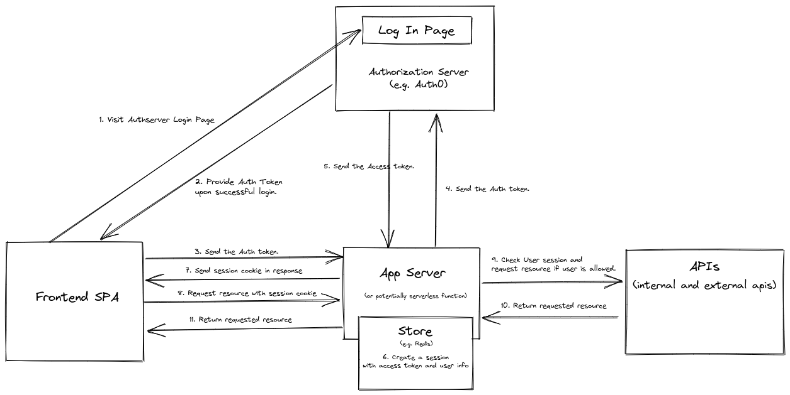

# CRA SPA with Auth0 and Server for User Session and CSRF Protection

This is a simple POC for a Single Page Application (CRA) with 0Auth Login and an express server to manage a user session.

## Motivations
- Use secure session cookie instead of JWT token for authentication and user session management in the browser.
- Use an OAuth flow for user login process while doing the above (connect to a third party service such as Auth0).

## Auth and Access Flow

## Advantages
- More secure with secure session cookie than jwt in browser
- Can manage user session (can list, analyse, revoke sessions) - potentially OAuth flow may not be required.
- Could potentially look at the possibility of serverless for both server and store.

## Disadvantages
- More complicated than just JWT in case of using OAuth
- Extra server layer required for session management

## Further Investigation Required
- Does this work with Webpack Module Federation?

## POC Demo Application
### Components
- Single Page Application (Create React App)
- Express (Nodejs) Server

### How to run the app
1. clone this repo.
2. Populate `.env.example` with your auth0 application credentials/details and rename it `.env`.   
3. `yarn install`
4. `yarn run build` to build the app.
5. `yarn run start` to start the application after the build is finished.
6. Visit `http://localhost:3000`

### References
Great Udemy OAuth Overview course
https://www.udemy.com/course/oauth-2-simplified/

OAuth Community Site
https://oauth.net/

Arguments to use Session cookie instead of JWT
- http://cryto.net/~joepie91/blog/2016/06/13/stop-using-jwt-for-sessions/
- http://cryto.net/~joepie91/blog/2016/06/19/stop-using-jwt-for-sessions-part-2-why-your-solution-doesnt-work/
- https://developer.okta.com/blog/2017/08/17/why-jwts-suck-as-session-tokens
- https://www.youtube.com/watch?v=GdJ0wFi1Jyo
- https://www.youtube.com/watch?v=U6OcC0yq1CE